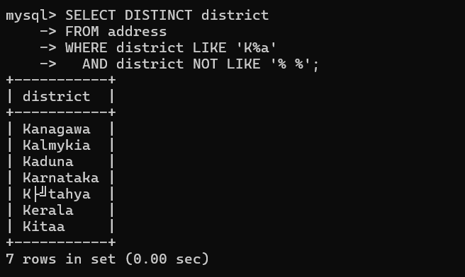
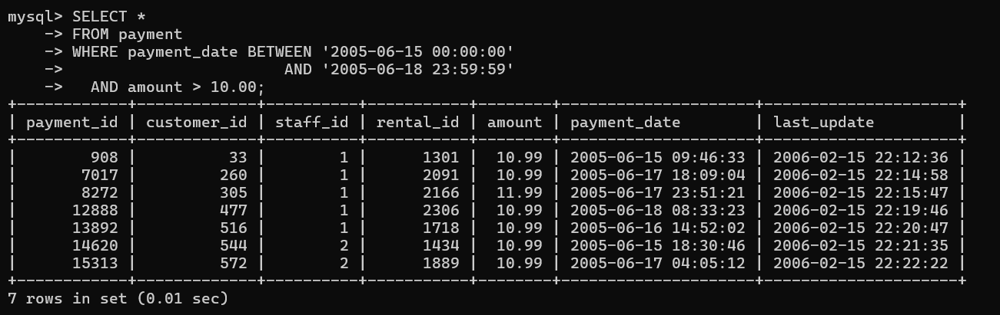
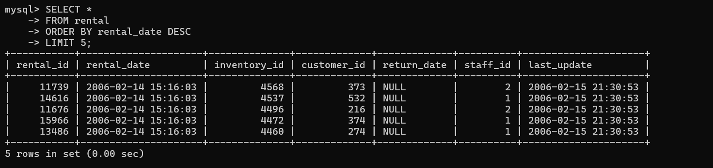
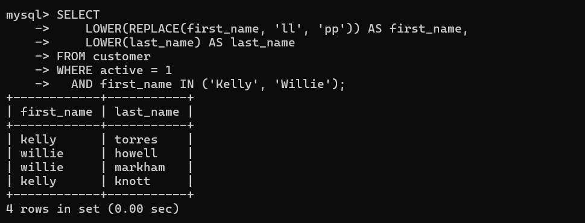

## Задание 1

```sql
SELECT DISTINCT district
FROM address
WHERE district LIKE 'K%a'
  AND district NOT LIKE '% %';
```



## Задание 2

```sql
SELECT *
FROM payment
WHERE payment_date BETWEEN '2005-06-15 00:00:00'
                       AND '2005-06-18 23:59:59'
  AND amount > 10.00;
```



## Задание 3

```sql
SELECT *
FROM rental
ORDER BY rental_date DESC
LIMIT 5;
```



## Задание 4

```sql
SELECT
    LOWER(REPLACE(first_name, 'll', 'pp')) AS first_name,
    LOWER(last_name) AS last_name
FROM customer
WHERE active = 1
  AND first_name IN ('Kelly', 'Willie');
```


